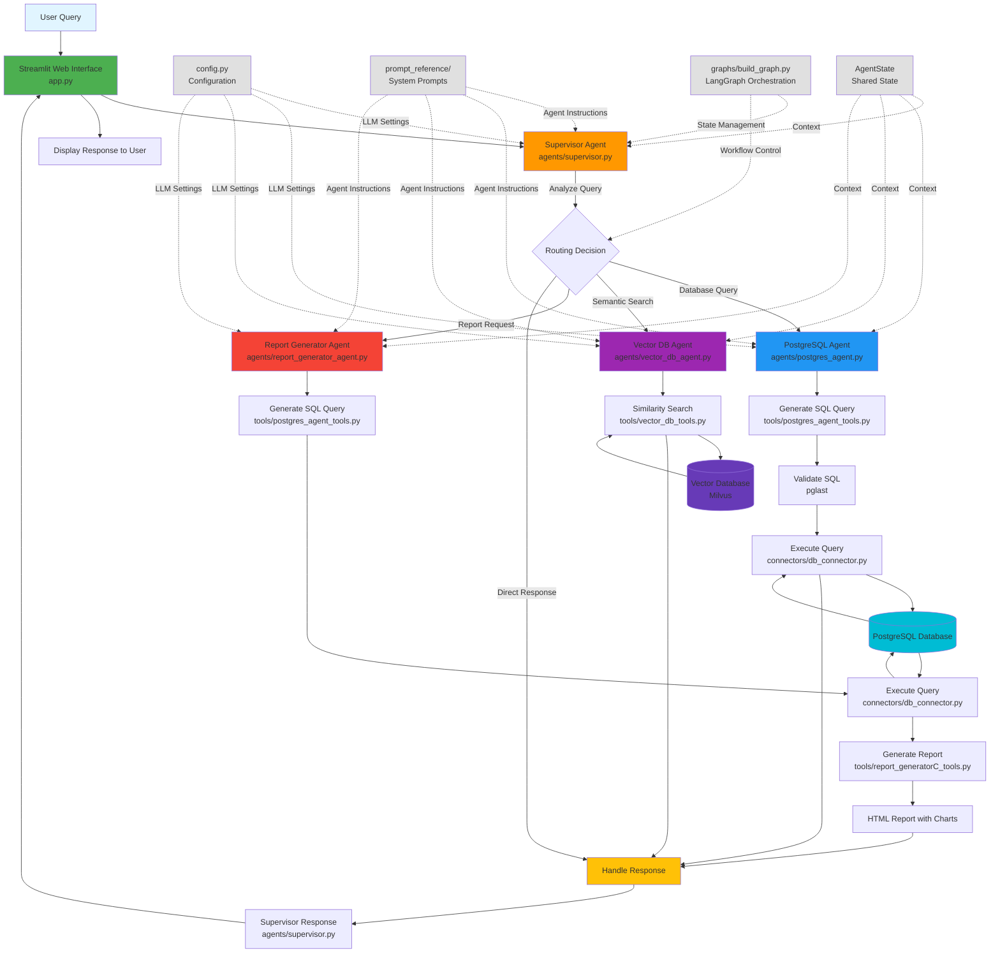

# Agentic AI Base Repo
## IT Productivity Agent

An AI-powered multi-agent system designed to enhance IT productivity by intelligently routing queries to specialized agents for database operations, vector search, and report generation.

## Quick Start

### Environment Set-up

#### Using Conda

1. Navigate to the parent directory of the repo:

```bash
cd ...\DevOpsAssist
```

2. Run the following conda command:

```bash
conda env create -f environment.yml
```

3. Activate the environment:

```bash
conda activate devops_agent_env
```

#### Using Python Venv

1. Navigate to the parent directory of the repo:

```bash
cd ...\DevOpsAssist
```

2. Run the following command on your terminal to create a virtual environment:

```bash
python3.12 -m venv devops_agent_env
```

3. Activate the Virtual Environment

   For macOS/Linux:
   ```bash
   source devops_agent_env/bin/activate
   ```
   
   For Windows:
   ```bash
   devops_agent_env\Scripts\activate
   ```

4. Install Dependencies from requirements.txt file:

```bash
pip install --upgrade pip  # (optional, but recommended)
pip install -r requirements.txt
```

### Running the Application

After completing the environment setup, run the Streamlit application:

```bash
streamlit run app.py
```

The application will launch in your default web browser, providing an interactive interface to interact with the AI agents.

## Repository Structure

```
DevOpsAssist/
├── agents/                          # Agent implementations
│   ├── base_agent.py               # Base agent class with shared functionality
│   ├── supervisor.py               # Supervisor agent for routing queries
│   ├── postgres_agent.py           # PostgreSQL database operations agent
│   ├── vector_db_agent.py          # Vector database search agent
│   └── report_generator_agent.py   # Report generation agent
├── connectors/                      # Database and service connectors
│   ├── db_connector.py             # PostgreSQL database connector
│   ├── vector_db_connector.py      # Vector database connector
│   └── db_schemas/                 # Database schema definitions
│       └── table_schema.py
├── graphs/                          # LangGraph workflow definitions
│   └── build_graph.py              # Graph construction and orchestration
├── tools/                           # Agent-specific tools
│   ├── postgres_agent_tools.py     # SQL generation and execution tools
│   ├── vector_db_tools.py          # Vector similarity search tools
│   ├── supervisor_tools.py         # Supervisor routing tools
│   └── report_generatorC_tools.py  # Report generation tools
├── prompt_reference/                # System prompts for each agent
│   ├── supervisor_prompt.py
│   ├── postgres_agent_prompts.py
│   ├── vector_db_agent_prompts.py
│   ├── reportgenerate_agent_prompts.py
│   └── feedback_prompts.py
├── utils/                           # Utility functions
│   └── handle_configs.py           # Configuration management
├── images/                          # Static assets
│   ├── devops.jpg
│   └── Finastra-logo.jpg
├── reports/                         # Generated reports storage
├── tests/                           # Test files
├── app.py                          # Streamlit web application
├── main.py                         # CLI entry point and testing
├── config.py                       # Configuration settings
├── requirements.txt                # Python dependencies
├── environment.yml                 # Conda environment specification
└── README.md                       # This file
```

## Architecture and Design

### System Overview

The IT Productivity Agent is built on a **multi-agent architecture** using LangGraph for orchestration. The system employs a supervisor pattern where a central supervisor agent intelligently routes user queries to specialized agents based on the query type and requirements.

### Architecture Diagram



### Core Components

#### 1. Supervisor Agent (`agents/supervisor.py`)

The **Supervisor Agent** acts as the central orchestrator and decision-maker:

- **Responsibility**: Analyzes incoming user queries and routes them to the appropriate specialized agent
- **Decision Logic**: Uses LLM-based reasoning to determine query intent (database query, vector search, or report generation)
- **Routing**: Implements conditional routing logic to direct queries to:
  - `postgres_agent` - for structured database queries
  - `vector_db_agent` - for semantic search and document retrieval
  - `report_generator_agent` - for data visualization and reporting
  - `handle_response` - for direct responses without specialized processing

#### 2. PostgreSQL Agent (`agents/postgres_agent.py`)

Specialized agent for database operations:

- **SQL Generation**: Converts natural language queries into valid SQL statements
- **Query Validation**: Validates SQL syntax using pglast before execution
- **Query Execution**: Safely executes queries against the PostgreSQL database
- **Tools**:
  - `generate_query` - Natural language to SQL conversion
  - `validate_sql_query` - SQL syntax validation
  - `run_query` - Query execution and result retrieval

#### 3. Vector Database Agent (`agents/vector_db_agent.py`)

Handles semantic search and document retrieval:

- **Similarity Search**: Performs vector-based similarity search on embedded documents
- **Context Retrieval**: Retrieves relevant documentation and knowledge base articles
- **Tools**:
  - `similarity_search` - Vector-based document retrieval with configurable top-k results

#### 4. Report Generator Agent (`agents/report_generator_agent.py`)

Creates visual reports and analytics:

- **Data Aggregation**: Generates SQL queries for data aggregation
- **Visualization**: Creates interactive charts (bar, pie, line) using the data
- **Report Export**: Generates HTML reports with embedded visualizations
- **Tools**:
  - `generate_reports_tools` - Creates visual reports from query results
  - Inherits SQL generation and execution tools from PostgreSQL agent

### LangGraph Orchestration (`graphs/build_graph.py`)

The system uses **LangGraph** to define the workflow and state management:

```python
# Simplified workflow structure
Supervisor Agent (Entry Point)
    ↓
[Conditional Routing]
    ↓
├─→ PostgreSQL Agent → Generate SQL → Execute Query → Handle Response
├─→ Vector DB Agent → Similarity Search → Handle Response
└─→ Report Generator → Generate SQL → Create Report → Handle Response
```

**Key Features**:
- **State Management**: Shared `AgentState` (TypedDict) maintains context across all agents
- **Conditional Edges**: Dynamic routing based on supervisor decisions
- **Tool Binding**: Each agent has access to specific tools bound to their LLM
- **Memory Chain**: Tracks the complete execution flow for debugging and transparency

### State Management (`agents/base_agent.py`)

The `AgentState` TypedDict maintains shared state across all agents:

```python
- user_input: Original user query
- supervisor_decision: Routing decision
- tool_calls: Selected tool for execution
- postgres_query: Generated SQL query
- postgres_agent_response: Database query results
- vector_db_agent_response: Vector search results
- report_generation_response: Report generation status
- final_response: Final answer to user
- memory_chain: Complete execution trace
```

### Streamlit Application (`app.py`)

The web interface provides:

- **Interactive Chat**: Natural language query interface
- **Report Generation**: Visual report builder with customizable parameters
- **Real-time Feedback**: Step-by-step execution visibility
- **Report Export**: Download and email generated reports
- **Sentiment Analysis**: User feedback collection and analysis

### Configuration (`config.py`)

Centralized configuration for:
- LLM model selection and parameters
- Agent-specific settings
- Database connection parameters
- Tool configurations

### Design Patterns

1. **Agent Pattern**: Each agent is a specialized component with specific responsibilities
2. **Supervisor Pattern**: Central coordinator for intelligent routing
3. **Tool Pattern**: Reusable tools bound to agents via LangChain
4. **State Machine**: LangGraph manages state transitions and workflow
5. **Dependency Injection**: Configuration and LLM instances injected into agents

### Technology Stack

- **LangChain/LangGraph**: Agent orchestration and workflow management
- **Streamlit**: Web application framework
- **PostgreSQL**: Structured data storage
- **Milvus/Vector DB**: Vector embeddings and semantic search
- **IBM watsonx.ai**: LLM provider for agent reasoning
- **pglast**: SQL query validation

## Features

- 🤖 **Multi-Agent System**: Specialized agents for different query types
- 🔍 **Semantic Search**: Vector-based document retrieval
- 📊 **Report Generation**: Interactive data visualizations
- 💬 **Natural Language Interface**: Query databases using plain English
- 📧 **Email Reports**: Send generated reports via email
- 📈 **Dashboard Integration**: Links to GitHub and ADO dashboards
- 💭 **Feedback System**: Sentiment analysis on user feedback

## Usage Examples

### Database Queries
```
"How many tickets are open from last 1 year?"
"What is the release date of activemq 6.1.4?"
```

### Vector Search
```
"Which version of jboss supports openjdk 11?"
"Is azure sql tested for any OS platform?"
```

### Report Generation
```
"Generate a report of the number of issues by status in the jira database"
```
